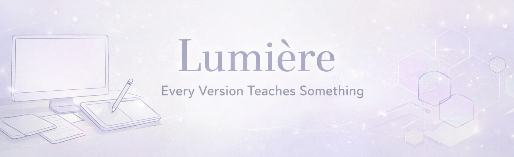

<!-- Banner -->

  

# 🌫️ Lumière — Every Version Teaches Something

Lumière is a soft‑tech aesthetic website I originally built when I was in **Class 11**, assisted by AI tools.  
It began as a small experiment — just curiosity, trial and error, and a lot of late‑night tinkering.  
Even though AI helped me, every design choice, fix, and revision came from my own vision.

---

## ✨ About Lumière
A creative space for:
- Digital invitations  
- Aesthetic edits  
- Soft‑copy designs  
- Minimal custom visuals  

It’s my personal corner of the internet — where design meets emotion and every version teaches something new.

---

## 💡 Vision
To craft digital designs that feel soft, intentional, and human — blending minimal tech aesthetics with creativity.

---

## 🛠️ Tech Stack
- **HTML5**  
- **CSS3**  
- **JavaScript**  
- **AI‑assisted design workflow**  
- **Figma** for layout planning  

---

## 🌱 Growth Philosophy
> Every version teaches something.  
> Every project is a learning experience.  
> Every builder starts somewhere.

---

## 🔮 Future Plans
- Rebuild Lumière with my own refined skills  
- Add interactive order forms and dynamic themes  
- Integrate a small portfolio section
